# Heart-Disease-Prediction

### Quick overview:
This project is done fully in R. Its goal is to fit a model to most accurately predict whether a patient will have or is at risk of having a **cardiovascular disease** based on variables like **cholesterol levels**, **sex**, **age**, **resting blood pressure**, etc.

[EDA & Variable Analysis](https://github.com/ckelaid/Heart-Disease-Prediction/blob/main/Heart-Disease---Analysis-2.pdf)

[Model Selection & Fitting](https://github.com/ckelaid/Heart-Disease-Prediction/blob/main/Hear-Disease---Model-Fitting-2.pdf)

### About the data:
The data is from a [Kaggle dataset](https://www.kaggle.com/fedesoriano/heart-failure-prediction?select=heart.csv).

It is composed of 918 observations and 12 variables including the response:
- Age: age of the patient [years]
- Sex: sex of the patient [M: Male, F: Female]
- ChestPainType: chest pain type [TA: Typical Angina, ATA: Atypical Angina, NAP: Non-Anginal Pain, ASY: Asymptomatic]
- RestingBP: resting blood pressure [mm Hg]
- Cholesterol: serum cholesterol [mm/dl]
- FastingBS: fasting blood sugar [1: if FastingBS > 120 mg/dl, 0: otherwise]
- RestingECG: resting electrocardiogram results [Normal: Normal, ST: having ST-T wave abnormality (T wave inversions and/or ST elevation or depression of > 0.05 mV), LVH: showing probable or definite left ventricular hypertrophy by Estes' criteria]
- MaxHR: maximum heart rate achieved [Numeric value between 60 and 202]
- ExerciseAngina: exercise-induced angina [Y: Yes, N: No]
- Oldpeak: oldpeak = ST [Numeric value measured in depression]
- ST_Slope: the slope of the peak exercise ST segment [Up: upsloping, Flat: flat, Down: downsloping]
- HeartDisease: output class [1: heart disease, 0: Normal]

## Project Overview

### EDA

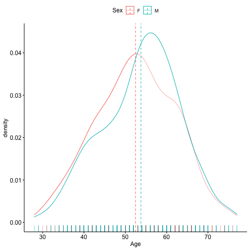

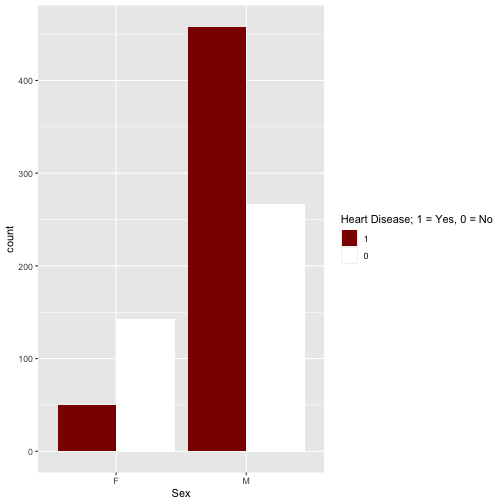

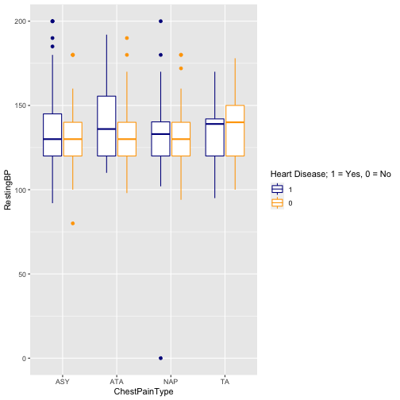 

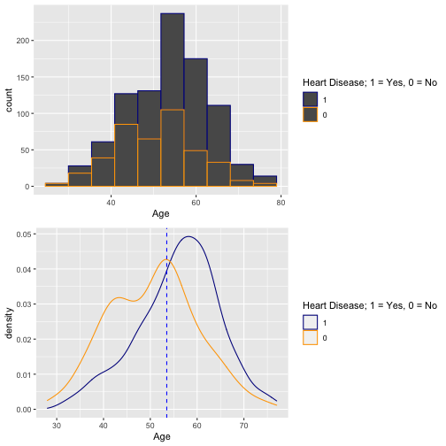 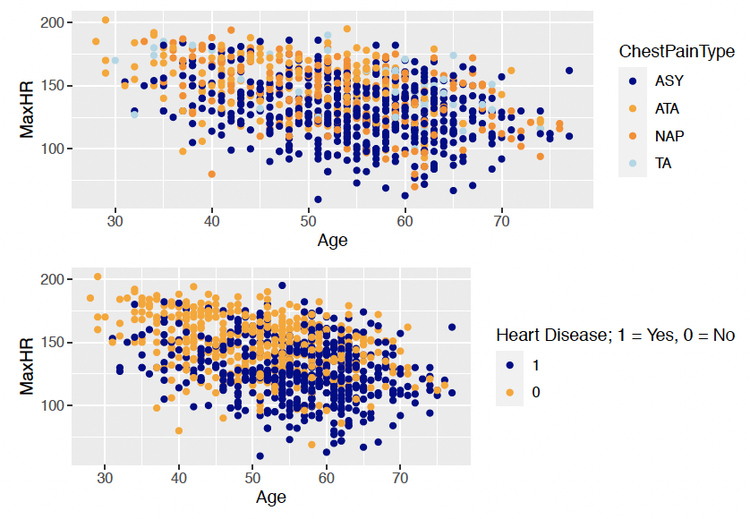 

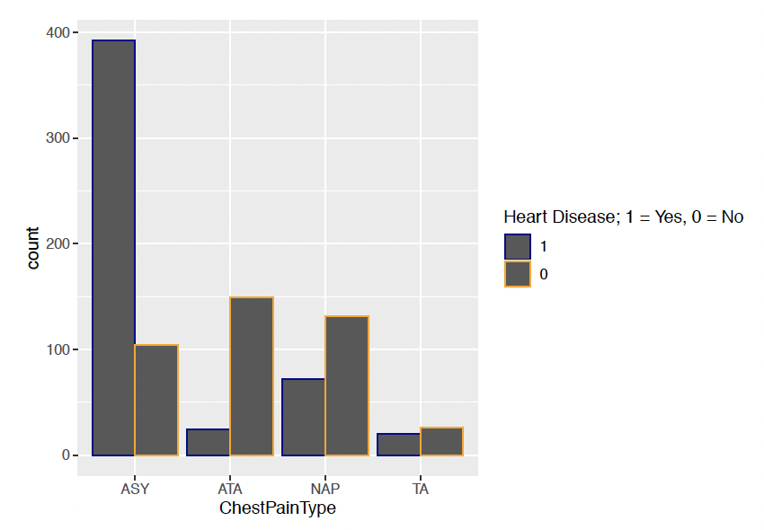

#### Best Subset Selection Metrics

After exploring the variables and their relationship, we ran a Best Subset Selection method to see what what variables were noted as significant based on BSS.

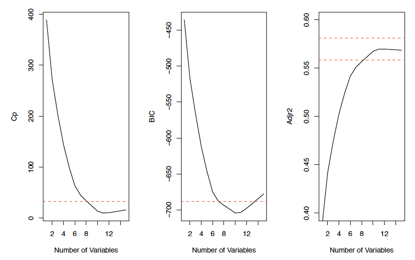

We see based on the above metrics (Cp, BIC, Adjusted-R2), a model of size 7 seems sufficient, but we also tested using Cross-Validation (CV) to see what size model was preferred.

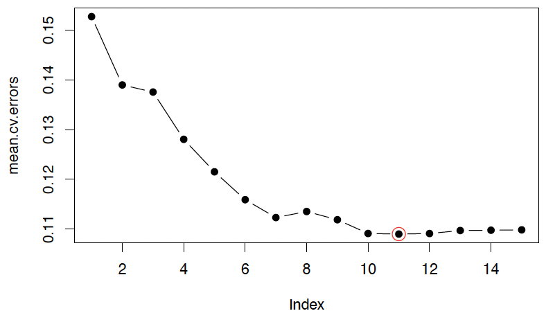

Using CV, BSS suggested a model of size 11 with the following variables:
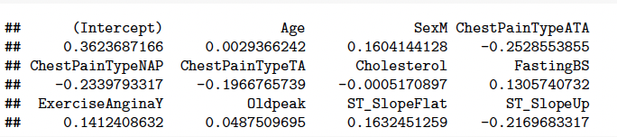

Whether the 7 variable model or 11 variable model is preferred depends on if our end goal is interpretability or just prediction, and also how much the accuracy is increased depending on the variable count to determine what is worth.

### Model Selection

#### Proposed Models
- Logistic regression
- LDA
- KNN with K = 5
- Lasso
- SVM or SVC depending on linear nature of decision-boundary
- Classification Tree/Random forest

We fit the above models on 2/3 of the training data and used the other 1/3 for testing purposes.

Some more variable selection was done in this part, as some of the above methods perform variable selection (Logistic Regression and Lasso particularly).

ROC curves of the best performing models:
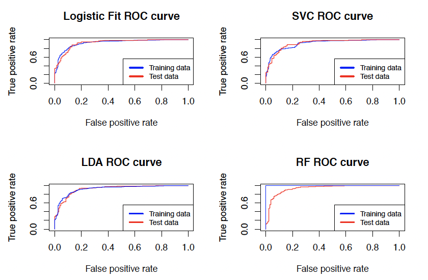

We used the Classification Error Rate as an evaluation metric:
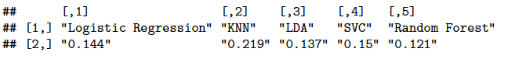

As per the above, the best performing model was the random forest, which is great because it also offers substantial interpretability. 

We see our Random Forest used 500 trees to get the error to stabilize:
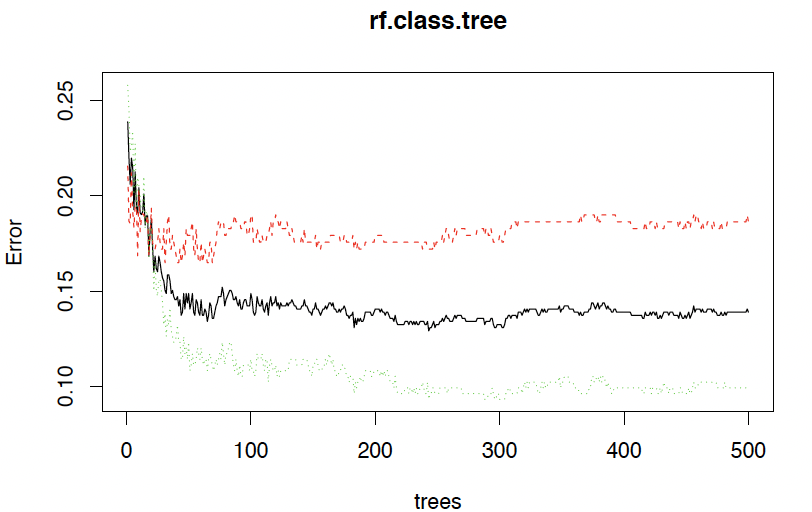

Here is how the Random Forest classified the variables based on importance in predicting our response (Heart Disease):
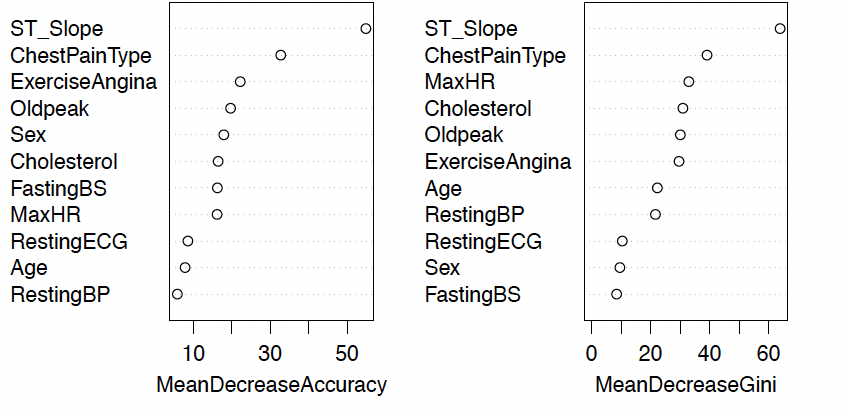
